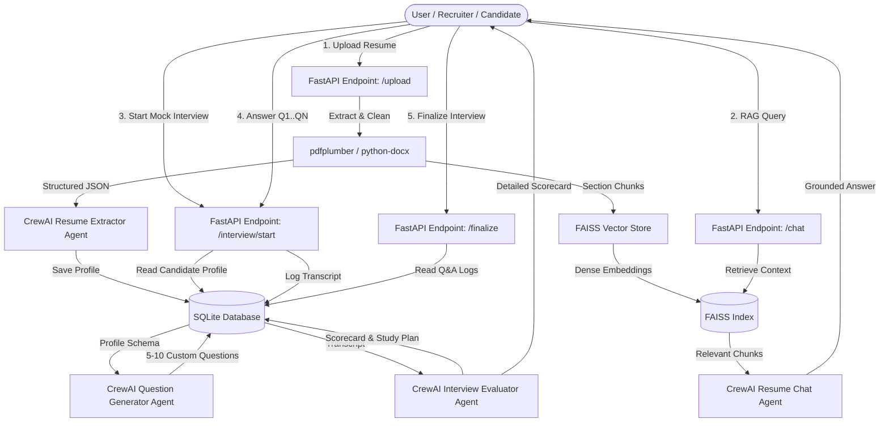

# Agentic Hiring, RAG Chat & Interactive Mock Interview Platform 🚀

[](https://fastapi.tiangolo.com/)
[](https://www.crewai.com/)
[](https://github.com/facebookresearch/faiss)
[](https://www.sqlite.org/)
[](https://www.python.org/)

An enterprise-grade **AI-Driven Hiring & Candidate Evaluation System** built with **FastAPI**, **CrewAI**, **FAISS**, and **SQLite**. The platform ingests candidate resumes (PDF, DOCX, TXT), parses unstructured content into validated Pydantic JSON schemas, stores section-aware vector chunks for RAG queries, and conducts **interactive step-by-step mock interviews** with automated performance scoring.

---

## 🌟 Key Features

1. **Multi-Stage Resume Ingestion & Structured Parsing**:
   - Parses `.pdf`, `.docx`, and `.txt` files with header and list structure preservation using `pdfplumber` and `python-docx`.
   - Uses CrewAI `ResumeExtractorAgent` with Pydantic output validation to extract personal info, work experience, tech stack, skills, education, projects, and certifications.
2. **Dual Storage Synchronization**:
   - **SQLite**: Persists candidate profiles, interview sessions, Q&A transcripts, and evaluation reports.
   - **FAISS Vector DB**: Indexes enriched section chunks (`[WORK EXPERIENCE]`, `[PROJECTS]`, `[TECHNICAL SKILLS]`, `[EDUCATION]`) isolated by `document_id`.
3. **Agentic RAG "Chat with Resume"**:
   - CrewAI `ResumeChatAgent` equipped with custom FAISS retrieval tool to answer detailed candidate background queries grounded strictly in resume context.
4. **Dynamic Mock Interview & Sequential State Machine**:
   - CrewAI `InterviewGeneratorAgent` synthesizes 5–10 customized technical, behavioral, and architectural questions aligned with candidate skills and optional `target_role` / `job_description`.
   - Serves questions sequentially one-by-one (`/start`, `/next`, `/answer`).
5. **AI Performance Scoring & Scorecard Generation**:
   - CrewAI `InterviewEvaluatorAgent` analyzes full transcript against candidate claims.
   - Computes an overall score (0–100%), candidate strengths, knowledge gaps, and an actionable **"Areas to Work More On"** study plan.
6. **Interactive Terminal CLI (`cli_interview.py`)**:
   - Conduct step-by-step mock interviews directly in your command line with colorful formatting, resume selection/upload, interactive prompts, and instant scorecard rendering.

---

## 🏗️ System Architecture



---

## 🛠️ Technology Stack

| Layer | Technology | Purpose |
| :--- | :--- | :--- |
| **API Framework** | FastAPI (Python 3.10+) | Async REST API & OpenAPI docs |
| **Multi-Agent Engine** | CrewAI | Autonomous agents for extraction, RAG, question generation & evaluation |
| **LLM Provider** | OpenRouter / OpenAI GPT-4o / Claude 3.5 | Intelligence engine for agents & embeddings |
| **Vector Store** | FAISS (`faiss-cpu`) | Dense semantic vector index per `document_id` |
| **Relational Database** | SQLite + SQLAlchemy | Relational persistence for candidates, Q&A logs & scorecards |
| **Schema Validation** | Pydantic v2 | Strict JSON type validation |

---

## 📂 Project Structure

```
.
├── main.py                # FastAPI main application entrypoint & middleware
├── config.py              # Application settings & OpenRouter configuration
├── database.py            # SQLite database engine & session management
├── models.py              # SQLAlchemy database models (Resumes, Interviews, QA Logs, Evaluations)
├── schemas.py             # Pydantic v2 schemas for requests & responses
├── cli_interview.py       # Interactive Terminal CLI for step-by-step mock interviews
├── prd.md                 # Product Requirement Document & Specifications
├── architecture.md        # Technical architecture details & roadmap
├── requirements.txt       # Python dependencies
├── verify_phase1.py       # Phase 1 verification script
├── verify_phase2.py       # Phase 2 verification script
├── test_app.py            # Pytest automated integration test suite
├── agents/
│   └── crew_manager.py    # CrewAI agents (Extractor, Chat, Question Generator, Evaluator)
├── routes/
│   ├── resumes.py         # Ingestion & Chat API endpoints
│   └── interviews.py      # Mock Interview state machine & evaluation endpoints
├── services/
│   ├── extractor.py       # Text extraction utilities (PDF, DOCX, TXT)
│   └── vector_store.py    # Section-aware chunking & FAISS manager
└── data/                  # Local uploads & persistent FAISS vector store
```

---

## 🚀 Quickstart & Setup

### 1. Prerequisites
- Python 3.10 or higher installed.
- OpenRouter API Key (or OpenAI API Key).

### 2. Installation
Clone the repository and set up a virtual environment:

```bash
git clone https://github.com/saket0x07/crewai-based-automation.git
cd crewai-based-automation

# Create virtual environment
python -m venv venv

# Activate virtual environment
# On Windows:
.\venv\Scripts\activate
# On macOS/Linux:
source venv/bin/activate

# Install dependencies
pip install -r requirements.txt
```

### 3. Environment Configuration
Create a `.env` file in the root directory (refer to `.env.example`):

```env
APP_NAME="Agentic Hiring & Candidate Evaluation System"
DEBUG=True
DATABASE_URL="sqlite:///./app.db"

# LLM & Embedding Settings
OPENROUTER_API_KEY="your_openrouter_api_key_here"
OPENROUTER_MODEL="openai/gpt-4o-mini"
EMBEDDING_MODEL="text-embedding-3-small"
```

---

## 💻 Running the Application

### Option A: Launch FastAPI Server & API Docs

Start the FastAPI application server:

```bash
python main.py
```

- **Interactive API Documentation (Swagger UI)**: Open `http://127.0.0.1:8000/docs` in your browser.
- **Alternative Docs (ReDoc)**: Open `http://127.0.0.1:8000/redoc`.

---

### Option B: Interactive Terminal Interview CLI

You can conduct step-by-step mock interviews right inside your command-line terminal!

1. Ensure the FastAPI server is running in one terminal window (`python main.py`).
2. Open a second terminal window and run:

```bash
python cli_interview.py
```

#### Terminal Interface Walkthrough:
```
======================================================================
  INTERACTIVE MOCK INTERVIEW SETUP
======================================================================

Existing Candidate Resumes in System:
  [1] Saket (Saket-Resume.pdf) - ID: 03e05faf...
  [2] Alice Smith (alice_smith_resume.txt) - ID: 086f677c...
  [U] Upload a New Resume File
  [Q] Quit

Select an option (1-2, U, Q): 1
Selected Candidate: Saket

Enter Target Job Title (optional, e.g. 'Senior Backend Engineer'): AI Engineer
How many questions would you like? (3-10, default 5): 3

======================================================================
  QUESTION 1 OF 3  [TECHNICAL]
======================================================================
Can you explain how you designed real-time data pipelines using FastAPI and Spark?

Commands: Type your answer below, or type ':skip' to skip, ':exit' to quit.
Your Answer > I implemented PySpark streaming consumers with FastAPI async handlers...
```

---

## 📡 REST API Endpoint Reference

| Method | Endpoint | Description |
| :--- | :--- | :--- |
| `POST` | `/api/v1/resumes/upload` | Upload PDF/DOCX/TXT resume, parse structured JSON & index into FAISS |
| `GET` | `/api/v1/resumes/{document_id}` | Retrieve stored candidate structured profile JSON |
| `POST` | `/api/v1/resumes/{document_id}/chat` | Query candidate resume content using CrewAI Agentic RAG |
| `POST` | `/api/v1/interview/start` | Initialize mock interview session & generate custom questions |
| `GET` | `/api/v1/interview/{interview_id}/next` | Get current question in sequential state machine |
| `POST` | `/api/v1/interview/{interview_id}/answer` | Record candidate response text and advance question state |
| `POST` | `/api/v1/interview/{interview_id}/finalize` | Trigger CrewAI performance evaluation & generate scorecard |
| `GET` | `/api/v1/interview/{interview_id}/report` | Retrieve saved evaluation scorecard report from SQLite |

---

## 🧪 Running Automated Tests

Run the full integration test suite using `pytest`:

```bash
pytest test_app.py -v
```

Verification output:
```text
test_app.py::test_root_endpoint PASSED
test_app.py::test_resume_upload_and_mock_interview_flow PASSED

======================= 2 passed in 42.70s =======================
```

---

## 📜 License
This project is licensed under the MIT License.
