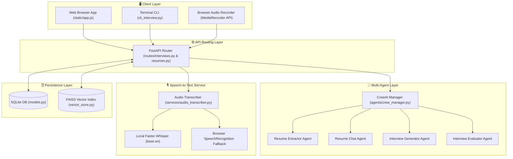

# Agentic Hiring, RAG Chat & Interactive Voice Mock Interview Platform 🚀

[](https://fastapi.tiangolo.com/)
[](https://www.crewai.com/)
[](https://github.com/facebookresearch/faiss)
[](https://github.com/SYSTRAN/faster-whisper)
[](https://www.sqlite.org/)
[](https://www.python.org/)

An enterprise-grade **AI-Driven Hiring & Candidate Evaluation System** built with **FastAPI**, **CrewAI**, **FAISS**, **Faster-Whisper**, and **SQLite**. The platform ingests candidate resumes (PDF, DOCX, TXT), parses unstructured content into validated Pydantic JSON schemas, indexes section-aware vector chunks for RAG queries, and conducts **interactive voice-enabled mock interviews** with real-time Speech-to-Text and automated performance scoring.

---

## 🌟 Key Features

1. **Multi-Stage Resume Ingestion & Structured Parsing**:
   - Parses `.pdf`, `.docx`, and `.txt` files with header and list structure preservation using `pdfplumber` and `python-docx`.
   - Uses CrewAI `ResumeExtractorAgent` with Pydantic output validation to extract personal info, work experience, tech stack, skills, education, projects, and certifications.
2. **Dual Storage Synchronization**:
   - **SQLite**: Persists candidate profiles, interview sessions, Q&A transcripts, and evaluation reports.
   - **FAISS Vector DB**: Indexes enriched section chunks (`[WORK EXPERIENCE]`, `[PROJECTS]`, `[TECHNICAL SKILLS]`, `[EDUCATION]`) isolated by `document_id`.
3. **Agentic RAG "Chat with Resume"**:
   - CrewAI `ResumeChatAgent` equipped with custom FAISS retrieval tool to answer detailed candidate background queries grounded strictly in resume context.
4. **Dynamic Mock Interview Engine & State Machine**:
   - CrewAI `InterviewGeneratorAgent` synthesizes 5–10 customized questions tailored to candidate resume experience, optional `target_role`, `job_description`, **Seniority Level** (Junior, Mid, Senior, Lead/Staff), and **Focus Area** (Full Mix, Technical Deep-Dive, System Design & Architecture, Behavioral & Leadership).
   - Serves questions sequentially one-by-one (`/start`, `/next`, `/answer`, `/answer/voice`).
5. **Real-Time Voice Answer Recording & Local STT**:
   - Transcribes spoken audio answers using local zero-cost **`Faster-Whisper` (`base.en`)** with **technical domain vocabulary prompting** (boosting accuracy for terms like *FastAPI, PySpark, PostgreSQL, Docker, FAISS, CrewAI, Kubernetes*).
   - Seamless zero-latency fallback to browser SpeechRecognition (`window.SpeechRecognition`) and client-side worker (`static/whisper-worker.js`).
6. **AI Performance Scoring & Scorecard Generation**:
   - CrewAI `InterviewEvaluatorAgent` analyzes full transcript against candidate claims.
   - Computes an overall score (0–100%), candidate strengths, knowledge gaps, and an actionable **"Areas to Work More On"** study plan.
7. **Dual Interface Support (Web UI & Terminal CLI)**:
   - **Web UI**: Modern glassmorphism frontend (`static/index.html` & `static/app.js`) with live microphone recording controls, real-time transcript preview, progress bar, and scorecard modal.
   - **Terminal CLI (`cli_interview.py`)**: Conduct step-by-step mock interviews directly in your terminal with colorful formatting, seniority selection, and scorecard rendering.

---

## 🏗️ System Architecture



---

## 🛠️ Technology Stack

| Layer | Technology | Purpose |
| :--- | :--- | :--- |
| **API Framework** | FastAPI (Python 3.10+) | Async REST API & OpenAPI docs |
| **Multi-Agent Engine** | CrewAI | Autonomous agents for extraction, RAG, question generation & evaluation |
| **Speech-to-Text (STT)** | `faster-whisper` + Web Speech API | High-accuracy local 8-bit quantized CPU transcription with domain prompting |
| **LLM Provider** | OpenRouter / OpenAI GPT-4o / Claude 3.5 | Intelligence engine for agents & embeddings |
| **Vector Store** | FAISS (`faiss-cpu`) | Dense semantic vector index per `document_id` |
| **Relational Database** | SQLite + SQLAlchemy | Relational persistence for candidate profiles, Q&A logs & scorecards |
| **Schema Validation** | Pydantic v2 | Strict JSON type validation |

---

## 📂 Project Structure

```
├── main.py                    # FastAPI main application entrypoint & static middleware
├── config.py                  # Application settings & OpenRouter LLM configuration
├── database.py                # SQLite database engine & session management
├── models.py                  # SQLAlchemy database models (Resumes, Interviews, QA Logs, Evaluations)
├── schemas.py                 # Pydantic v2 schemas for requests & responses
├── cli_interview.py           # Interactive Terminal CLI for step-by-step mock interviews
├── requirements.txt           # Python dependencies
├── agents/                    # CrewAI multi-agent framework (Extractor, Chat, Generator, Evaluator)
│   └── crew_manager.py
├── docs/                      # Technical architecture, system diagrams & PRD specifications
│   ├── architecture.md
│   ├── interview_flow.md
│   └── prd.md
├── routes/                    # FastAPI REST API endpoints
│   ├── resumes.py
│   └── interviews.py
├── services/                  # Business logic services (STT Transcriber, Extractor, FAISS Vector Store)
│   ├── audio_transcriber.py
│   ├── extractor.py
│   └── vector_store.py
├── static/                    # Glassmorphism Web App UI assets
│   ├── index.html
│   ├── app.js
│   └── whisper-worker.js
└── tests/                     # Automated Pytest suite
    ├── __init__.py
    └── test_app.py
```

---

## 🚀 Quickstart & Setup

### 1. Prerequisites
- Python 3.10 or higher installed.
- OpenRouter API Key (or OpenAI API Key).

### 2. Installation
Clone the repository and set up a virtual environment:

```bash
git clone https://github.com/saket0x07/crewai-based-automation.git
cd crewai-based-automation

# Create virtual environment
python -m venv venv

# Activate virtual environment
# On Windows:
.\venv\Scripts\activate
# On macOS/Linux:
source venv/bin/activate

# Install dependencies
pip install -r requirements.txt
```

### 3. Environment Configuration
Create a `.env` file in the root directory (refer to `.env.example`):

```env
APP_NAME="Agentic Hiring & Candidate Evaluation System"
DEBUG=True
DATABASE_URL="sqlite:///./app.db"

# LLM & Embedding Settings
OPENROUTER_API_KEY="your_openrouter_api_key_here"
OPENROUTER_MODEL="openai/gpt-4o-mini"
EMBEDDING_MODEL="text-embedding-3-small"

# Optional: Faster-Whisper Local Model Size (default: base.en)
WHISPER_MODEL_SIZE="base.en"
```

---

## 💻 Running the Application

### Option A: Launch FastAPI Web Server & UI

Start the application server:

```bash
python main.py
```

- **Interactive Web App**: Open `http://127.0.0.1:8000/` in your browser.
- **Swagger API Docs**: Open `http://127.0.0.1:8000/docs`.

---

### Option B: Interactive Terminal Interview CLI

You can conduct step-by-step mock interviews directly inside your command-line terminal!

1. Ensure the FastAPI server is running in one terminal window (`python main.py`).
2. Open a second terminal window and run:

```bash
python cli_interview.py
```

#### Terminal Interface Walkthrough:
```
======================================================================
  INTERACTIVE MOCK INTERVIEW SETUP
======================================================================

Existing Candidate Resumes in System:
  [1] Saket (Saket-Resume.pdf) - ID: 03e05faf...
  [2] Alice Smith (alice_smith_resume.txt) - ID: 086f677c...
  [U] Upload a New Resume File
  [Q] Quit

Select an option (1-2, U, Q): 1
Selected Candidate: Saket

Enter Target Job Title: Senior AI Engineer

Select Seniority Level:
  [1] Junior Level (Fundamentals & Core Syntax)
  [2] Mid Level (Production Patterns & Query Tuning) [Default]
  [3] Senior Level (High Concurrency & Architecture Trade-offs)
  [4] Lead / Staff Level (Strategy & Scalability)
Choice (1-4, default 2): 3

Select Interview Focus Area:
  [1] Full Mix (Balanced 360° Assessment) [Default]
  [2] Technical Deep-Dive (Coding & Framework Internals)
  [3] System Design & Architecture (Microservices & Caching)
  [4] Behavioral & Leadership (STAR Method & Scenarios)
Choice (1-4, default 1): 3

======================================================================
  QUESTION 1 OF 5  [SYSTEM DESIGN & ARCHITECTURE]
======================================================================
Can you walk us through how you design high-throughput PySpark streaming data pipelines to handle backpressure and query latency?

Commands: Type your answer below, or type ':skip' to skip, ':exit' to quit.
Your Answer > I leveraged Kafka partitioning, stateful window aggregation, and FAISS indexing...
```

---

## 📡 REST API Endpoint Reference

| Method | Endpoint | Description |
| :--- | :--- | :--- |
| `POST` | `/api/v1/resumes/upload` | Upload PDF/DOCX/TXT resume, parse structured JSON & index into FAISS |
| `GET` | `/api/v1/resumes/` | List all ingested candidate profiles |
| `GET` | `/api/v1/resumes/{document_id}` | Retrieve stored candidate structured profile JSON |
| `POST` | `/api/v1/resumes/{document_id}/chat` | Query candidate resume content using CrewAI Agentic RAG |
| `POST` | `/api/v1/interview/start` | Initialize mock interview session with seniority & focus parameters |
| `GET` | `/api/v1/interview/{interview_id}/next` | Get current question in sequential state machine |
| `POST` | `/api/v1/interview/{interview_id}/answer` | Record text response and advance question state |
| `POST` | `/api/v1/interview/{interview_id}/answer/voice` | Record `.webm` audio, transcribe via `Faster-Whisper` & advance state |
| `POST` | `/api/v1/interview/transcribe` | Standalone audio transcription endpoint |
| `POST` | `/api/v1/interview/{interview_id}/finalize` | Trigger CrewAI performance evaluation & generate scorecard |
| `GET` | `/api/v1/interview/{interview_id}/report` | Retrieve saved evaluation scorecard report from SQLite |

---

## 📜 Documentation

- [docs/interview_flow.md](docs/interview_flow.md): Detailed visual sequence flow, system architecture diagrams, and database ER schemas.
- [docs/architecture.md](docs/architecture.md): Technical architecture specifications and implementation details.
- [docs/prd.md](docs/prd.md): Product Requirements Document and feature roadmap.

---

## 📜 License
This project is licensed under the MIT License.
