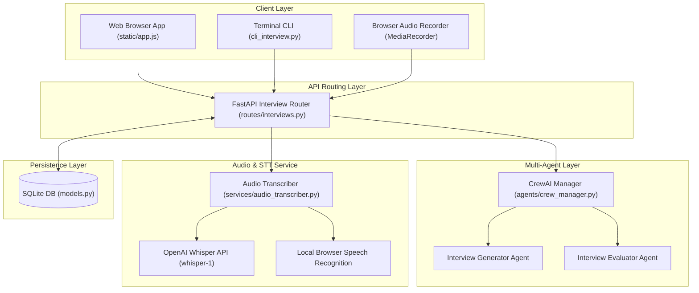
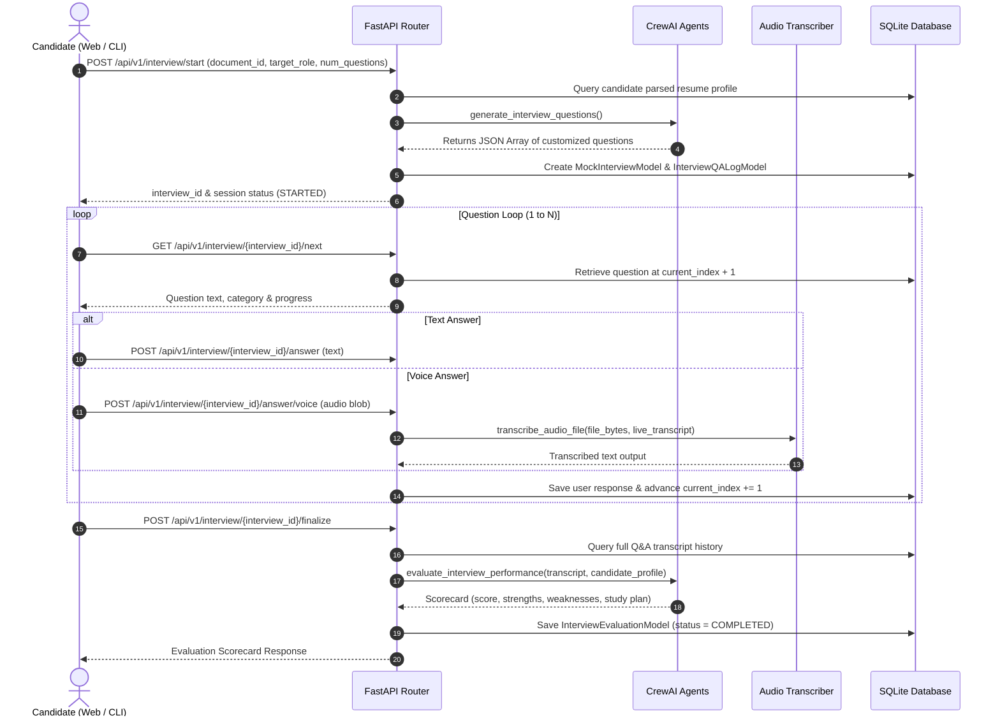
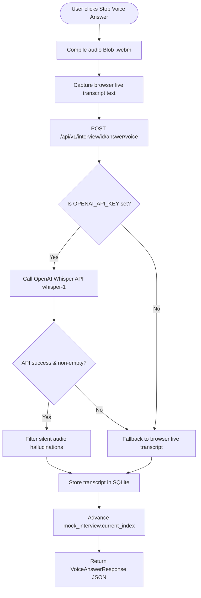
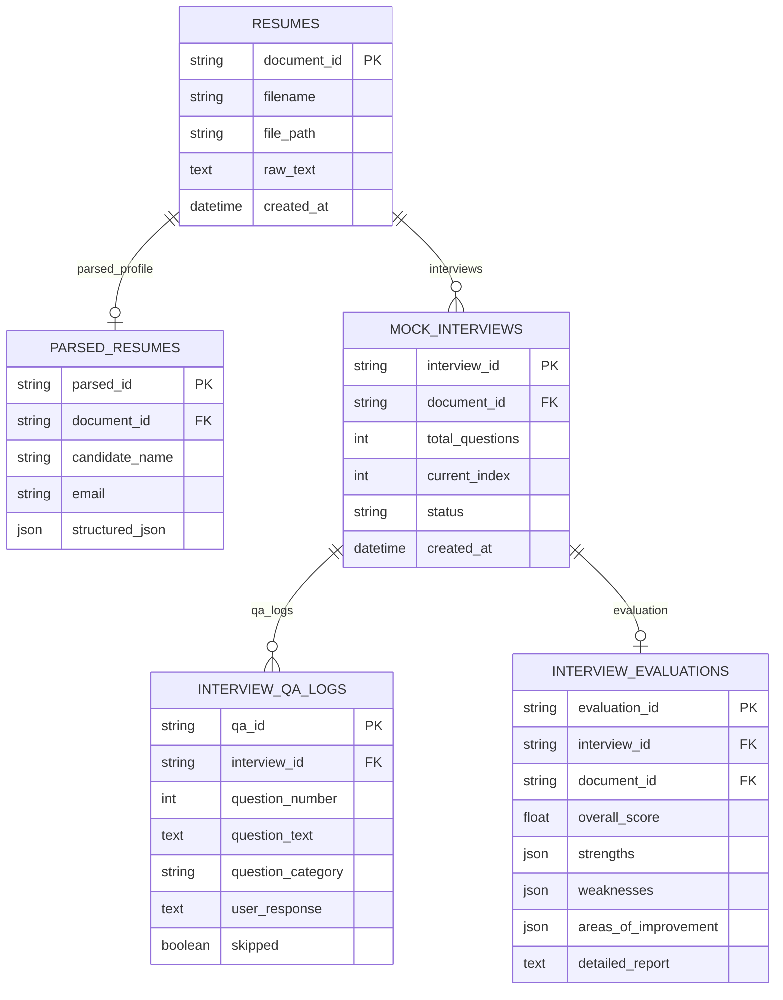

# 🎙️ Mock Interview Module Implementation Flow & Architecture

Comprehensive documentation detailing the architecture, execution flow, state machine, multi-agent operations, database schema, and speech-to-text fallback logic of the **Mock Interview System**.

---

## 📑 Table of Contents
1. [System Architecture](#1-system-architecture)
2. [End-to-End Sequence Flow](#2-end-to-end-sequence-flow)
3. [Lifecycle Phase Details](#3-lifecycle-phase-details)
   - [Phase 1: Session Initialization & Dynamic Question Generation](#phase-1-session-initialization--dynamic-question-generation)
   - [Phase 2: Sequential Question Serving (State Machine)](#phase-2-sequential-question-serving-state-machine)
   - [Phase 3: Answer Submission (Text & Voice STT)](#phase-3-answer-submission-text--voice-stt)
   - [Phase 4: Interview Finalization & AI Evaluation](#phase-4-interview-finalization--ai-evaluation)
   - [Phase 5: Evaluation Scorecard Retrieval](#phase-5-evaluation-scorecard-retrieval)
4. [Audio & Speech-to-Text (STT) Processing Flow](#4-audio--speech-to-text-stt-processing-flow)
5. [Database Schema & Models](#5-database-schema--models)
6. [User Interface Implementations](#6-user-interface-implementations)
7. [Key Code Files Reference](#7-key-code-files-reference)

---

## 1. System Architecture

The Mock Interview system uses a **FastAPI backend**, a **CrewAI Multi-Agent framework**, **SQLAlchemy (SQLite database)**, and dual client interfaces (Web Browser UI & Terminal CLI).

---

## 2. End-to-End Sequence Flow

---

## 3. Lifecycle Phase Details

### Phase 1: Session Initialization & Dynamic Question Generation
- **Endpoint**: `POST /api/v1/interview/start` in [routes/interviews.py](file:///d:/Fxis.ai/Crewai/routes/interviews.py#L39-L96)
- **Process**:
  1. Validates `document_id` and fetches `ParsedResumeModel` containing the extracted candidate profile.
  2. Invokes `generate_interview_questions()` in [agents/crew_manager.py](file:///d:/Fxis.ai/Crewai/agents/crew_manager.py#L260-L374).
  3. The **`Interview Generator Agent`** synthesizes `num_questions` (5 to 10) targeted questions spanning:
     - **Technical Deep-Dives**: Probing frameworks and tech stack mentioned on candidate's resume.
     - **Project Architecture**: Exploring trade-offs and engineering choices in listed projects.
     - **Role-Specific System Design**: Customized to `target_role`.
     - **Behavioral Scenarios**: Handling outages, code reviews, and deadline pressures.
  4. Generates a new `interview_id` (UUID), stores `MockInterviewModel` (`status = IN_PROGRESS`), and populates `InterviewQALogModel` records.

### Phase 2: Sequential Question Serving (State Machine)
- **Endpoint**: `GET /api/v1/interview/{interview_id}/next` in [routes/interviews.py](file:///d:/Fxis.ai/Crewai/routes/interviews.py#L99-L131)
- **Process**:
  1. Checks `current_index` on `MockInterviewModel`.
  2. Queries `InterviewQALogModel` for `question_number == current_index + 1`.
  3. Returns question text, category, and `is_completed: false`.
  4. When `current_index >= total_questions`, returns `is_completed: true`.

### Phase 3: Answer Submission (Text & Voice STT)
- **Text Endpoint**: `POST /api/v1/interview/{interview_id}/answer` in [routes/interviews.py](file:///d:/Fxis.ai/Crewai/routes/interviews.py#L134-L167)
- **Voice Endpoint**: `POST /api/v1/interview/{interview_id}/answer/voice` in [routes/interviews.py](file:///d:/Fxis.ai/Crewai/routes/interviews.py#L170-L218)
- **Process**:
  1. Accepts text input or `.webm` audio recording blob.
  2. For voice submissions, routes through `transcribe_audio_file()` in [services/audio_transcriber.py](file:///d:/Fxis.ai/Crewai/services/audio_transcriber.py#L8-L100).
  3. Updates `user_response` and sets `skipped = False`.
  4. Increments `mock_interview.current_index += 1` to advance the state machine.

### Phase 4: Interview Finalization & AI Evaluation
- **Endpoint**: `POST /api/v1/interview/{interview_id}/finalize` in [routes/interviews.py](file:///d:/Fxis.ai/Crewai/routes/interviews.py#L222-L279)
- **Process**:
  1. Collects all Q&A logs for `interview_id`.
  2. Invokes `evaluate_interview_performance()` in [agents/crew_manager.py](file:///d:/Fxis.ai/Crewai/agents/crew_manager.py#L376-L465).
  3. The **`Interview Evaluator Agent`** analyzes responses against expected complexity and candidate resume claims, returning:
     - `overall_score`: Floating point score from `0.0` to `100.0`.
     - `strengths`: Demonstrated technical competencies.
     - `weaknesses`: Identified knowledge gaps or skipped topics.
     - `areas_of_improvement`: Actionable study plan.
     - `detailed_report`: Executive narrative summary.
  4. Persists `InterviewEvaluationModel` record and sets `mock_interview.status = COMPLETED`.

### Phase 5: Evaluation Scorecard Retrieval
- **Endpoint**: `GET /api/v1/interview/{interview_id}/report` in [routes/interviews.py](file:///d:/Fxis.ai/Crewai/routes/interviews.py#L282-L314)
- **Process**:
  1. Retrieves stored evaluation and full Q&A transcript history from SQLite.

---

## 4. Audio & Speech-to-Text (STT) Processing Flow

---

## 5. Database Schema & Models

Defined in [models.py](file:///d:/Fxis.ai/Crewai/models.py):

---

## 6. User Interface Implementations

### 🌐 Web Interface (`static/app.js`)
- Manages recording state via `MediaRecorder` API.
- Runs Transformers.js local worker (`static/whisper-worker.js`) and SpeechRecognition in parallel.
- Provides real-time dynamic UI state updates, question progress bar, and evaluation modal.

### 💻 Interactive CLI (`cli_interview.py`)
- Terminal interface with ANSI color highlights.
- Fetches uploaded candidate resumes or triggers resume file upload.
- Interactive question loop supporting `:skip` and `:exit` commands.
- Renders formatted terminal scorecard upon interview completion.

---

## 7. Key Code Files Reference

| File | Path | Description |
| :--- | :--- | :--- |
| **API Router** | [routes/interviews.py](file:///d:/Fxis.ai/Crewai/routes/interviews.py) | Exposes `/start`, `/{id}/next`, `/{id}/answer`, `/{id}/answer/voice`, `/{id}/finalize`, and `/{id}/report`. |
| **CrewAI Manager** | [agents/crew_manager.py](file:///d:/Fxis.ai/Crewai/agents/crew_manager.py) | Implements `generate_interview_questions()` and `evaluate_interview_performance()`. |
| **Audio Transcriber** | [services/audio_transcriber.py](file:///d:/Fxis.ai/Crewai/services/audio_transcriber.py) | Speech-to-Text transcriber routing between Whisper API and browser fallbacks. |
| **Database Models** | [models.py](file:///d:/Fxis.ai/Crewai/models.py) | SQLAlchemy models for session state, logs, and evaluations. |
| **Pydantic Schemas** | [schemas.py](file:///d:/Fxis.ai/Crewai/schemas.py) | Request and response schema definitions. |
| **Terminal CLI** | [cli_interview.py](file:///d:/Fxis.ai/Crewai/cli_interview.py) | Interactive CLI mock interview suite. |
| **Web Frontend** | [static/app.js](file:///d:/Fxis.ai/Crewai/static/app.js) | Client-side controller for browser voice recording and state machine. |
