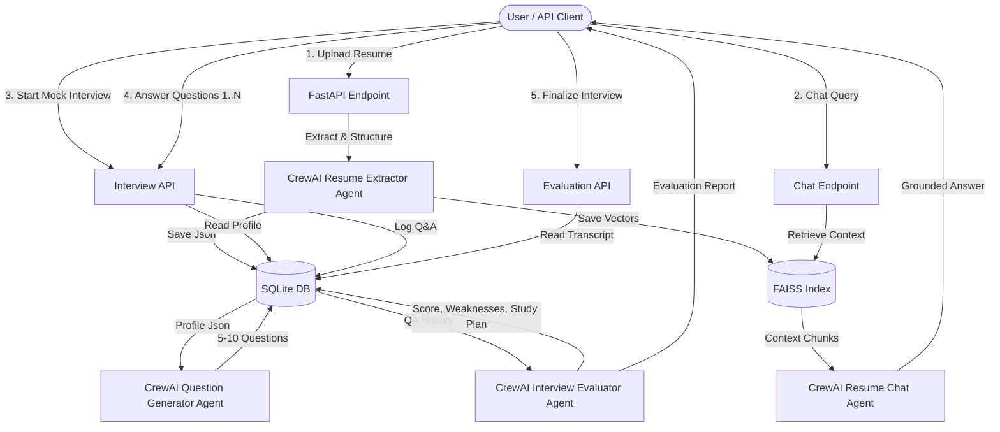

# Product Requirement Document (PRD): Agentic Resume Ingestion, RAG Chat & Mock Interview System

## 1. Executive Summary & Core Objectives
The **Agentic Hiring & Candidate Evaluation System** is an AI-driven platform designed to ingest candidate resumes, extract structured data, store vectors and relational metadata for intelligent retrieval, enable interactive RAG-based conversations, and conduct automated mock interviews with performance evaluation.

Built on **FastAPI**, **CrewAI**, **FAISS**, and **SQLite**, the system automates two primary workflows:
1. **Resume Ingestion & RAG Chat**: Seamless parsing of PDF/DOCX resumes into validated JSON schemas, chunking and embedding into FAISS, storing relational metadata in SQLite, and providing a CrewAI multi-agent interface to query resume content by `document_id`.
2. **Interactive Mock Interview & Evaluation**: Generating 5–10 customized technical and behavioral questions tailored to the candidate's resume, serving questions sequentially, collecting user answers, performing AI evaluation, and persisting comprehensive gap analysis in SQLite.

---

## 2. Technical Stack & Architectural Overview

| Component | Technology / Library | Purpose |
| :--- | :--- | :--- |
| **API Layer** | FastAPI (Python 3.10+) | High-performance async REST API endpoints |
| **Agent Framework** | CrewAI | Orchestrating autonomous agents for extraction, chat RAG, question generation, and evaluation |
| **Vector Database** | FAISS (`faiss-cpu` / `faiss-gpu`) | In-memory / persistent vector index for dense semantic search per `document_id` |
| **Relational Database** | SQLite (via SQLAlchemy / AsyncPG or standard `sqlite3`) | Persistent storage for resumes, structured profiles, mock interview sessions, questions, and evaluation reports |
| **Structured Data Parsing** | Pydantic v2 & Instructor / LangChain / OpenAI Structured Output | Strict type validation for candidate profiles, QA logs, and evaluation reports |
| **Embeddings & LLM** | OpenAI Embeddings (`text-embedding-3-small` / Ollama / HuggingFace) & GPT-4o / Claude / Llama 3 | Text representation and intelligence engine for CrewAI agents |

---

## 3. Core Features & Functional Requirements

### Feature 1: Resume Ingestion & Structured Extraction Pipeline

The ingestion and extraction workflow follows a multi-stage agentic hiring pipeline:

```
[ PDF / DOCX Upload ] 
       │
       ▼
[ 1. Document Parsing & Noise Cleaning ] (pdfplumber / python-docx)
       │
       ▼
[ 2. CrewAI ResumeExtractorAgent ] ──► [ Pydantic JSON Validation ]
       │
       ▼
[ 3. Dual Storage Distribution ]
       ├──► [ SQLite DB ] (Raw Text + Structured JSON + Document Meta)
       └──► [ Section-Aware Chunking & Embedding ] ──► [ FAISS Vector Store ]
```

#### Detailed Pipeline Stages:
1. **Document Upload & Unique Identification**:
   - Accepts PDF (`.pdf`) and Word (`.docx`) resume documents.
   - Generates a unique UUID4 `document_id` for document isolation and session tracking.
2. **Text Extraction & Layout Parsing**:
   - Uses `pdfplumber` / `python-docx` to extract text while maintaining header hierarchies and bullet lists.
   - Applies text normalization (removing unwanted control characters, redundant whitespace, and page artifacts).
3. **Agentic Structured Extraction (CrewAI + Pydantic)**:
   - CrewAI `ResumeExtractorAgent` processes raw resume text and enforces a strict `StructuredResumeSchema`:
     - `personal_info`: Full Name, Email, Phone, LinkedIn, GitHub, Portfolio, Location.
     - `professional_summary`: Brief executive summary of background.
     - `work_experience`: Array of roles containing Job Title, Company, Location, Start/End Dates, Key Achievements, and Tech Stack utilized.
     - `skills`: Categorized list (Programming Languages, Frameworks, Cloud & DevOps, Databases, Soft Skills).
     - `education`: Degree, Major, Institution, Graduation Year, GPA.
     - `projects`: Project Name, Description, Technologies Used, Repo/Demo URLs.
     - `certifications`: Title, Issuing Organization, Date.
     - `calculated_metrics`: Extracted total years of experience and top candidate domains.
4. **Section-Aware Semantic Chunking & Enrichment**:
   - Splits resume into semantic chunks based on logical sections (`Work Experience`, `Projects`, `Technical Skills`, `Education`) rather than arbitrary token boundaries.
   - Enriches each chunk with metadata tags: `document_id`, `section_type`, `candidate_name`, `skill_tags`.
5. **Dual Storage Synchronization**:
   - **SQLite**: Persists document metadata, raw text, and validated structured JSON in `resumes` and `parsed_resumes` tables.
   - **FAISS Vector DB**: Computes embeddings for all enriched section chunks and updates the vector index tagged with `document_id`.

---

### Feature 2: "Chat with Resume" (CrewAI Agent RAG)
- **Agentic RAG Engine**: CrewAI agent (`Resume Query Agent`) equipped with a specialized FAISS retrieval tool filtered by `document_id`.
- **Query Endpoint**: Accepts `document_id` and candidate/recruiter `query`.
- **Capabilities**:
  - Answers specific queries regarding skills, experience duration, project context, or suitability for roles.
  - Returns grounded responses with clear citation of resume sections.
  - Maintains conversation history tied to session IDs.

---

### Feature 3: Mock Interview Module & Sequential Evaluation

#### Workflow Steps:
1. **Question Generation**:
   - Endpoint: `POST /api/v1/interview/start` with `document_id`.
   - CrewAI `Interview Question Generator Agent` analyzes the candidate's extracted profile.
   - Synthesizes **5 to 10 tailored interview questions** covering:
     - Core Technical Skills claimed on resume.
     - Practical implementation details from listed projects.
     - Behavioral and problem-solving scenarios matching work experience level.
   - Generates a unique `interview_id` and initializes an interview session in SQLite.

2. **Sequential Presentation & Interaction**:
   - Endpoint: `GET /api/v1/interview/{interview_id}/next`
   - Serves questions **one after another** (Step-by-step sequence: Question 1 of N -> Wait for user input -> Question 2 of N).
   - User actions per question:
     - Submit answer text.
     - Proceed / Skip ("Yes" / "No" / Next).

3. **Response Evaluation & Gap Analysis**:
   - Endpoint: `POST /api/v1/interview/{interview_id}/finalize`
   - Once all questions are answered or ended by the user, the CrewAI `Interview Evaluator Agent` processes the complete transcript.
   - Performs granular assessment:
     - **Accuracy Score** (0–100% per question & overall).
     - **Strengths**: Concepts demonstrated clearly by the candidate.
     - **Weaknesses / Knowledge Gaps**: Areas where answers were vague, incorrect, or missing.
     - **Actionable Study Plan ("Where to Work More")**: Recommended learning topics, technologies, or skills to practice.
   - **Persistence**: Saves full evaluation details, individual Q&A scores, and overall metrics into SQLite linked to `document_id` and `interview_id`.

---

## 4. Database Schema Specification (SQLite)

```sql
-- Resumes Table
CREATE TABLE IF NOT EXISTS resumes (
    document_id VARCHAR(36) PRIMARY KEY,
    filename VARCHAR(255) NOT NULL,
    file_path VARCHAR(500) NOT NULL,
    raw_text TEXT NOT NULL,
    created_at TIMESTAMP DEFAULT CURRENT_TIMESTAMP
);

-- Parsed Resume Metadata Table
CREATE TABLE IF NOT EXISTS parsed_resumes (
    parsed_id VARCHAR(36) PRIMARY KEY,
    document_id VARCHAR(36) UNIQUE NOT NULL,
    candidate_name VARCHAR(255),
    email VARCHAR(255),
    phone VARCHAR(50),
    structured_json JSON NOT NULL,
    created_at TIMESTAMP DEFAULT CURRENT_TIMESTAMP,
    FOREIGN KEY (document_id) REFERENCES resumes(document_id) ON DELETE CASCADE
);

-- Mock Interview Sessions Table
CREATE TABLE IF NOT EXISTS mock_interviews (
    interview_id VARCHAR(36) PRIMARY KEY,
    document_id VARCHAR(36) NOT NULL,
    total_questions INT NOT NULL,
    current_index INT DEFAULT 0,
    status VARCHAR(50) DEFAULT 'IN_PROGRESS', -- IN_PROGRESS, COMPLETED, ABORTED
    created_at TIMESTAMP DEFAULT CURRENT_TIMESTAMP,
    updated_at TIMESTAMP DEFAULT CURRENT_TIMESTAMP,
    FOREIGN KEY (document_id) REFERENCES resumes(document_id) ON DELETE CASCADE
);

-- Interview Question & Answer Logs Table
CREATE TABLE IF NOT EXISTS interview_qa_logs (
    qa_id VARCHAR(36) PRIMARY KEY,
    interview_id VARCHAR(36) NOT NULL,
    question_number INT NOT NULL,
    question_text TEXT NOT NULL,
    question_category VARCHAR(100), -- Technical, Project, Behavioral
    user_response TEXT,
    skipped BOOLEAN DEFAULT FALSE,
    created_at TIMESTAMP DEFAULT CURRENT_TIMESTAMP,
    FOREIGN KEY (interview_id) REFERENCES mock_interviews(interview_id) ON DELETE CASCADE
);

-- Interview Evaluations Table
CREATE TABLE IF NOT EXISTS interview_evaluations (
    evaluation_id VARCHAR(36) PRIMARY KEY,
    interview_id VARCHAR(36) UNIQUE NOT NULL,
    document_id VARCHAR(36) NOT NULL,
    overall_score FLOAT NOT NULL,
    strengths JSON NOT NULL,
    weaknesses JSON NOT NULL,
    areas_of_improvement JSON NOT NULL,
    detailed_report TEXT NOT NULL,
    created_at TIMESTAMP DEFAULT CURRENT_TIMESTAMP,
    FOREIGN KEY (interview_id) REFERENCES mock_interviews(interview_id) ON DELETE CASCADE,
    FOREIGN KEY (document_id) REFERENCES resumes(document_id) ON DELETE CASCADE
);
```

---

## 5. FastAPI Endpoints Architecture

```
POST /api/v1/resumes/upload
  ├── Input: Multipart File (PDF/DOCX)
  └── Response: { "document_id": "uuid", "filename": "...", "status": "PARSED_AND_INDEXED" }

GET /api/v1/resumes/{document_id}
  ├── Query: document_id
  └── Response: Structured JSON profile extracted from resume

POST /api/v1/resumes/{document_id}/chat
  ├── Input: { "query": "What experience does candidate have in Docker?" }
  └── Response: { "document_id": "uuid", "answer": "...", "sources": [...] }

POST /api/v1/interview/start
  ├── Input: { "document_id": "uuid", "num_questions": 7 }
  └── Response: { "interview_id": "uuid", "total_questions": 7, "status": "STARTED" }

GET /api/v1/interview/{interview_id}/next
  ├── Query: interview_id
  └── Response: { "question_number": 1, "total_questions": 7, "question_text": "...", "category": "Technical" }

POST /api/v1/interview/{interview_id}/answer
  ├── Input: { "question_number": 1, "response_text": "...", "proceed": true }
  └── Response: { "status": "RECORDED", "has_next": true }

POST /api/v1/interview/{interview_id}/finalize
  ├── Input: interview_id
  └── Response: { "evaluation_id": "uuid", "overall_score": 85.0, "strengths": [...], "weaknesses": [...], "areas_to_work_on": [...] }

GET /api/v1/interview/{interview_id}/report
  ├── Query: interview_id
  └── Response: Complete stored evaluation report from SQLite
```

---

## 6. CrewAI Multi-Agent Architecture



---

## 7. Next Steps & Implementation Milestones

1. **Phase 1: Database & Core Models Setup**:
   - Initialize SQLAlchemy database models for SQLite.
   - Set up Pydantic v2 schemas for Resume, Interview, and Evaluation data.
2. **Phase 2: Ingestion & FAISS Vector Service**:
   - Implement PDF/DOCX parsing.
   - Build FAISS vector storage wrapper supporting metadata filtering per `document_id`.
   - Build CrewAI `ResumeExtractorAgent` with structured output capabilities.
3. **Phase 3: Chat Agent Integration**:
   - Build FAISS retriever tool for CrewAI.
   - Implement `ResumeChatAgent` and endpoint `POST /api/v1/resumes/{document_id}/chat`.
4. **Phase 4: Mock Interview & Evaluation Engine**:
   - Build `QuestionGeneratorAgent` (creates 5–10 customized questions).
   - Build stateful sequential Q&A flow in FastAPI (`start`, `next`, `answer`).
   - Build `EvaluatorAgent` for scoring, strength/weakness extraction, and storing evaluations in SQLite.
5. **Phase 5: Verification & End-to-End Testing**:
   - Write pytest test cases for file parsing, vector retrieval, chat agent, mock interview state machine, and evaluation report generation.
